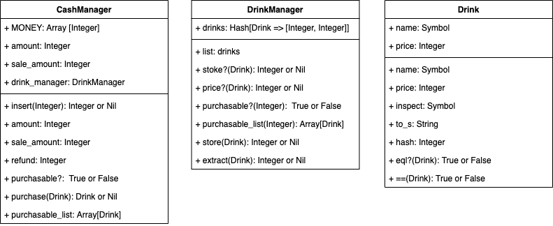

#　自販機プログラム

## 初めに

自動販売機
下記の課題に取り組んだものである。
現在作成途中。

[TDD Boot Camp 大阪 3.0/課題( #tddbc )](http://devtesting.jp/tddbc/?TDDBC%E5%A4%A7%E9%98%AA3.0%2F%E8%AA%B2%E9%A1%8C)

## class設計

CashManager, DrinkManager, Drinkの３つのクラスを作成し、それぞれに機能を持たせる。VendingMachineは、CashManager, DrinkManagerを統合して操作するインターフェイスとしての機能。



## 初期設定

- 自動販売機は、インスタンス化したときのドリンクの初期値は以下の通り。

| ドリンク名 | 値段 | 在庫 |
|-|-|-|
| :coke | 120 | 5 |
| :redbull | 200 | 5 |
| :water | 100 | 5 |

- 投入可能な金額は以下の通り。

10, 50, 100, 500, 1000

- ドリンクに関しては、Drinkクラスを作成し、インスタンス化している。

  ```ruby
  Drink.new(:coke, 120)
  ```

- 自動販売機をインスタンス化すると、Drinkクラスに以下の3つのクラスメソッドが作成される。

  ```ruby
  Drink.coke    # => Drink.new(:coke, 120) と同じ意味
  Drink.water   # => Drink.new(:water, 100) と同じ意味
  Drink.redbull # => Drink.new(:redbull, 200) と同じ意味
  ```

## 使用方法

以下は、irbで実行。

### ファイルの読み込み

```ruby
require_relative "lib/vending_machine"
```

### 自販機の初期化

```ruby
# 引数を指定しなければ、初期設定の:coke, :water, :redbullを各5本ずつ保持する
vm = VendingMachine.new

# ドリンクをオリジナルで設定したい場合は、以下のように引数を配列の入れ子構造で指定する
vm2 = VendingMachine.new([[:coke, 120, 1], [:water, 100, 100]])
```

### お金の投入、投入金額の総計の取得、払い戻し

```ruby
# 使用可能なお金を投入(複数回投入可能)
vm.insert 100 #=> nil

# 使用不可能なお金を投入(そのまま値が戻ってくる)
vm.insert 10000 #=> 10000

# 投入金額の総計の取得
vm.amount #=> 100

# 払い戻し
vm.refund # => 100
```

### 格納されているドリンクの情報

```ruby
# ドリンクリストの取得
vm.stock_list #=> {:coke => [120, 5], :water => [100, 5], :redbull => [200, 5]

# 価格の取得
vm.price :coke #=> 120

# 在庫数の取得
vm.stock :coke #=> 5
```

### 購入

```ruby
vm.insert 500

# 購入可能か確認（投入金額、在庫の点で）
vm.purchasable? :coke # => true

# 購入可能なドリンクリスト取得（投入金額、在庫の点で）
vm.purchasable_list # => [:coke, :water, :redbull]

# 購入操作: 投入金額、在庫が十分な場合
# 戻り値はDrinkのインスタンスとお釣り
vm.purchase :coke # => [Drink.coke, 380]

# 購入操作: 投入金額が不十分な場合
vm.purchase :coke # => nil

# 売上金額の取得
vm.sale_amount # => 120
```

### ドリンクの管理

```ruby
# ドリンクの補充: 既存のドリンクの場合
# 引数は、Drinkクラスのインスタンス
# 戻り値は在庫数
vm.store Drink.coke # => 6

# ドリンクの補充: 新たなドリンクの場合
vm.store Drink.new(:orange, 110) #=> 1
# 次回以降、ドリンク名のクラスメソッドが作成されるため、以下のことが可能
vm.store Drink.orange # => 2
```

## 未解決問題
- お金もオブジェクト。したがって、お金クラスを作った方が良いかも。
- ドリンクは、Drinkクラスでインスタンス化しているが、名前と値段を保持している。したがって、後で値段設定を変更しても、すでにインスタンス化したものの値段は変わらない。
